# User Guide


**KrustyKrab** is a lightweight and responsive desktop app for **restaurant staff** to quickly manage customer 
information and bookings. It is designed to be simple yet efficient.


At a glance, KrustyKrab allows you to:

- Easily manage customer information and their details.
- Efficiently manage and keep track of your customers' bookings and its status or details.
- Quickly view or filter relevant bookings or customers through the simple user interface.


KrustyKrab is optimized for use via keyboard commands without compromising aesthetics or user-friendliness. 
If you type fast, you’ll get your booking tasks done much quicker than with any mouse-based system.

<box type="info" seamless>

**IMPORTANT:** From here onwards, customers are referred to as **persons** in this user guide. This is for standardization purposes, 
as KrustyKrab allows you to save a person's information without them necessarily having a booking.

</box>

---
## Table of Contents
1. [Quick Start](#1-quick-start)
2. [Command Overview](#2-command-overview)
3. [Person Commands](#3-person-commands)
4. [Booking Commands](#4-booking-commands)
5. [General Commands](#5-general-commands)
6. [FAQ](#6-faq)
7. [Known Issues](#7-known-issues)
8. [Command Summary](#8-command-summary)
9. [Glossary](#9-glossary)

--------------------------------------------------------------------------------------------------------------------

## 1. Quick start

1. Ensure you have Java `17` or above installed on your computer.<br>
   Check if Java is already installed in the command terminal by typing: `java -version` <br>
   If the version shown is Java 17 or higher, you're good to go.<br>
   If not, download and install java 17 from [Oracle](https://www.oracle.com/java/technologies/downloads/#java17).<br>
   **Mac users:** Ensure you have the precise JDK version prescribed [here](https://se-education.org/guides/tutorials/javaInstallationMac.html).

2. Download the latest `krustykrab.jar` file from [here](https://github.com/AY2425S2-CS2103T-T08-2/tp/releases).

3. Copy the file to the folder you want to use as the home folder for KrustyKrab. (You may use any folder you like, 
but a **blank folder** is recommended.)

4. Open a command terminal and navigate into the folder in which you put the jar file using the `cd` (change directory) command. 
   For example, if you put the jar file in `C:\Users\JasonLim\KrustyHomeFolder\`, type the following command in the terminal and press _Enter_:
   ```bash
   cd C:\Users\JasonLim\KrustyHomeFolder\
   ```

5. Type the following command into the command terminal and press _Enter_ to run the application.
   ```bash
   java -jar krustykrab.jar
   ```
   A GUI similar to the below should appear in a few seconds. Note how the app contains some sample data.<br>
   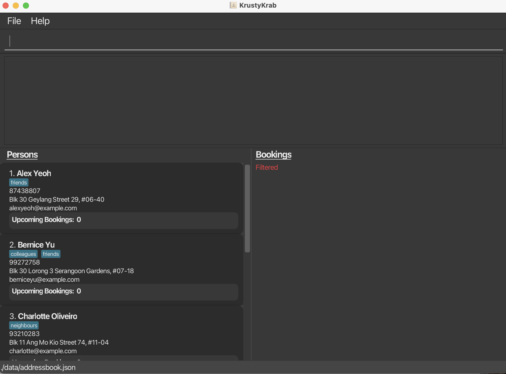


6. Type a command in the command box and press _Enter_ to execute it.  
**Example:** Typing `help` and pressing _Enter_ will open the help window.

<br>

Some example commands you can try:

   * `plist` : Lists all persons.
   * `padd n/John Doe p/98765432 e/johnd@example.com a/John street, block 123, #01-01` : Adds a person named `John Doe` to the person list.
   * `badd d/2021-10-01 3:00 PM p/98765432 x/5` : Adds a booking to the person with phone number 98765432.
   * `exit` : Exits the app.

<br>

--------------------------------------------------------------------------------------------------------------------

## 2. Command Overview

<box type="tip" seamless>

**Tips:** Refer to the [Command Summary](#8-command-summary) for a table containing the full list of commands.

</box>

The commands you can use in KrustyKrab are split into **3 different types**:

- [Person Commands](#3-person-commands)
- [Booking Commands](#4-booking-commands)
- [General Commands](#5-general-commands)

Let's walk you through some basics of the command format.

Each command consists of a **command word**, and zero or more **parameters**.

<box type="info" seamless>

**Notes about the command format:**<br>

* Words in `UPPER_CASE` are the parameters to be supplied by the user.<br>
  e.g. in `add n/NAME`, `NAME` is a parameter which can be used as `add n/John Doe`.

* Items in square brackets are optional.<br>
  e.g `n/NAME [t/TAG]` can be used as `n/John Doe t/nutsAllergy` or as `n/John Doe`.

* Parameters can be in any order.<br>
  e.g. if the command specifies `n/NAME p/PHONE_NUMBER`, `p/PHONE_NUMBER n/NAME` is also acceptable.

* Extraneous parameters for commands that do not take in parameters (such as `help`, `plist`, `blist`, and `exit`) will be ignored.<br>
  e.g. if the command specifies `help 123`, it will be interpreted as `help`.

</box>

<box type="warning" seamless style="background-color: #FFF9E5; border-color: #FFC000;">

**Caution:** If you are using a PDF version of this document, be careful when copying and pasting commands that span multiple lines as space characters surrounding line-breaks may be omitted when copied over to the application.

</box>

--------------------------------------------------------------------------------------------------------------------
## 3. Person Commands
A person has a **name, phone number, email, address, membership status** and optionally, **tags**.

<box type="note" seamless>

**Note:** 

KrustyKrab does not allow more than 1 person to have the same phone number.


</box>

<br>

### 3.1. Adding a person: `padd`

Adds a person to the persons list.

Format: `padd n/NAME p/PHONE_NUMBER e/EMAIL a/ADDRESS [m/IS_MEMBER] [t/TAG]…​`

<box type="tip" seamless>

**Tips:**
- A person's name must contain only alphanumeric characters.
- A person's default membership status is false unless you set it to true.
- A person can have any number of tags (including 0).

</box>

Examples:
* `padd n/John Doe p/98765432 e/johnd@example.com a/John street, block 123, #01-01 m/true`
* `padd n/Betsy Crowe t/seafoodAllergy e/betsycrowe@example.com a/Cotton Candy Land p/1234567`

`padd n/Alex Yeoh p/87438807 e/alexyeoh@example.com a/Blk 30 Geylang Street 29, #06-40 t/friends`
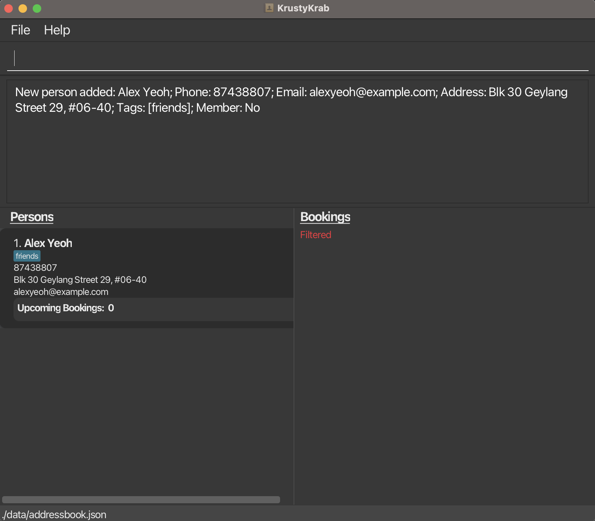

<br>

### 3.2. Editing a person: `pedit`

Edits the details of the person identified by the index number in the displayed persons list.  
Existing values will be overwritten by the input values.

Format:  
`pedit INDEX [n/NAME] [e/EMAIL] [a/ADDRESS] [m/IS_MEMBER] [t/TAG]…​`

<box type="tip" seamless>

**Tips:**
- `INDEX` refers to the position of the person in the **displayed person list** (must be a positive integer).
- At least one field must be provided.
- You **cannot edit the phone number** of a person.
- `IS_MEMBER` should be `true`/`false`, `1`/`0` or `yes`/`no` (Case Insensitive).

- Editing tags will replace all existing tags with the new set. To clear all tags, use `t/` without any value.

</box>

Examples:
* `pedit 1 e/johndoe@example.com`
* `pedit 3 a/123 Sunset Way m/true t/friend t/vip`
* `pedit 2 t/` (clears all tags)

`pedit 1 a/123 Sunset Way m/True t/vip`


<br>

### 3.3. Deleting a person : `pdelete`
Deletes the specified person from persons list.

Format: `pdelete INDEX`

<box type="tip" seamless>

**Tips:**
- `INDEX` refers to the index number shown in the **displayed persons list**.
- `INDEX` **must be a positive integer** 1, 2, 3, …​
  </box>


<box type="warning" seamless style="background-color: #FFF9E5; border-color: #FFC000;">

**Caution:** Deleting a person also deletes their associated bookings!

</box>

Examples:
* `list` followed by `pdelete 2` deletes the 2nd person in the persons list.
* `find Betsy` followed by `pdelete 1` deletes the 1st person in the results of the `find` command.

`pdelete 1`
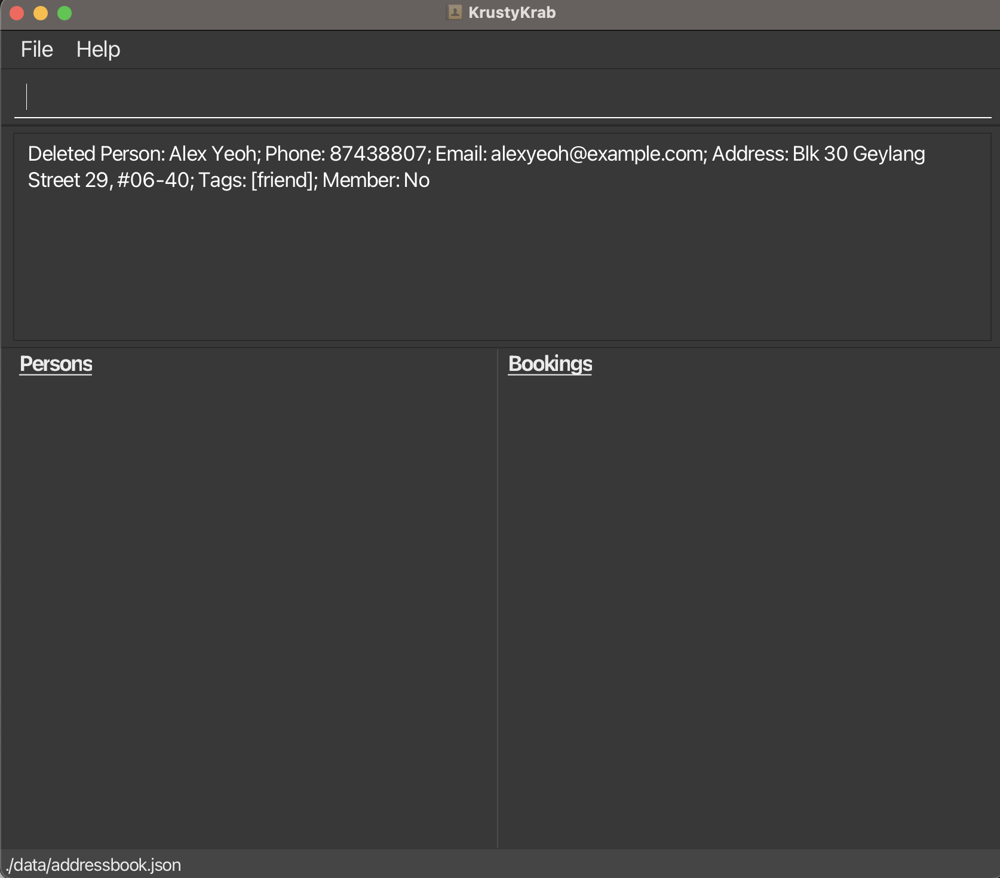

<br>

### 3.4. Finding persons by name: `find`

Finds all persons whose names contain any of the specified **full-word** keywords (case-insensitive), and displays them as a list with index numbers.

Format:  
`find KEYWORD [MORE_KEYWORDS]...`

<box type="tip" seamless>

**Tips:**
- Keyword matching is **case-insensitive** but only matches **whole words**.
- A keyword must match a full word in the person’s name (e.g., `alex` matches "Alex Tan" but not "Alexander").
- You can enter multiple keywords separated by spaces to match more people.

</box>

Examples:
* `find Alice` (matches "Alice Tan", but not "Malice")
* `find alex` (matches "Alex Tan", not "Alexander")
* `find John` returns `john` and `John Doe`
* `find alex david` returns `Alex Yeoh`, `David Li`

`find alex david`
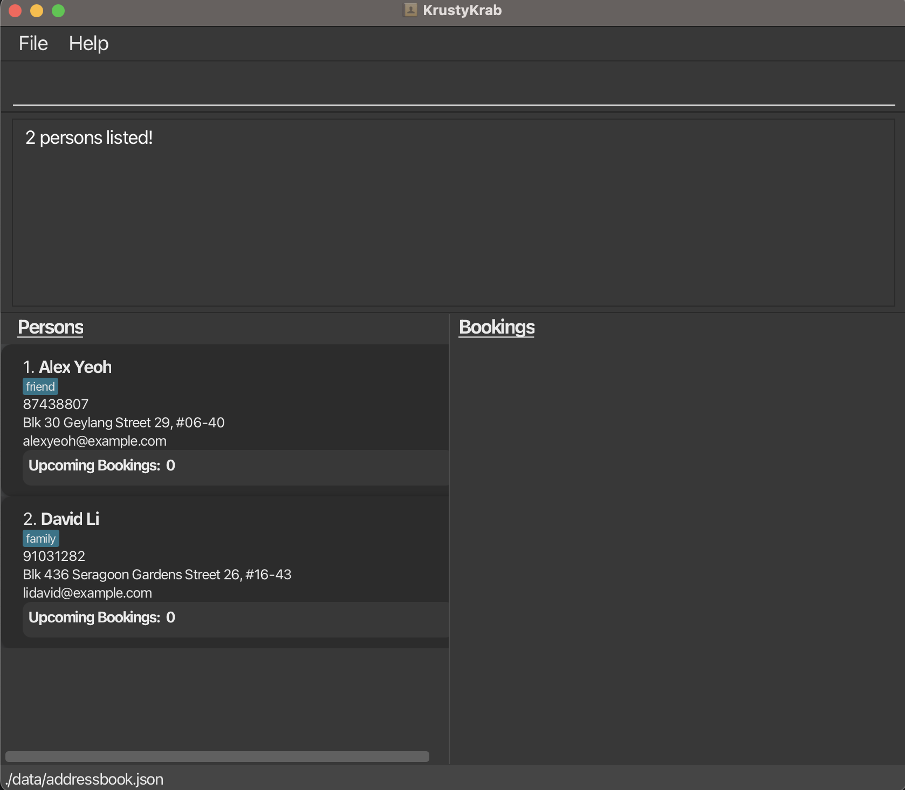

<br>

### 3.5. Listing all persons : `plist`

Shows a list of all persons in the persons list.

Format: `plist`

<box type="tip" seamless>

**Tip:**
- The persons list is sorted by the order in which they are added, with index 1 being the earliest added person.

</box>

`plist`
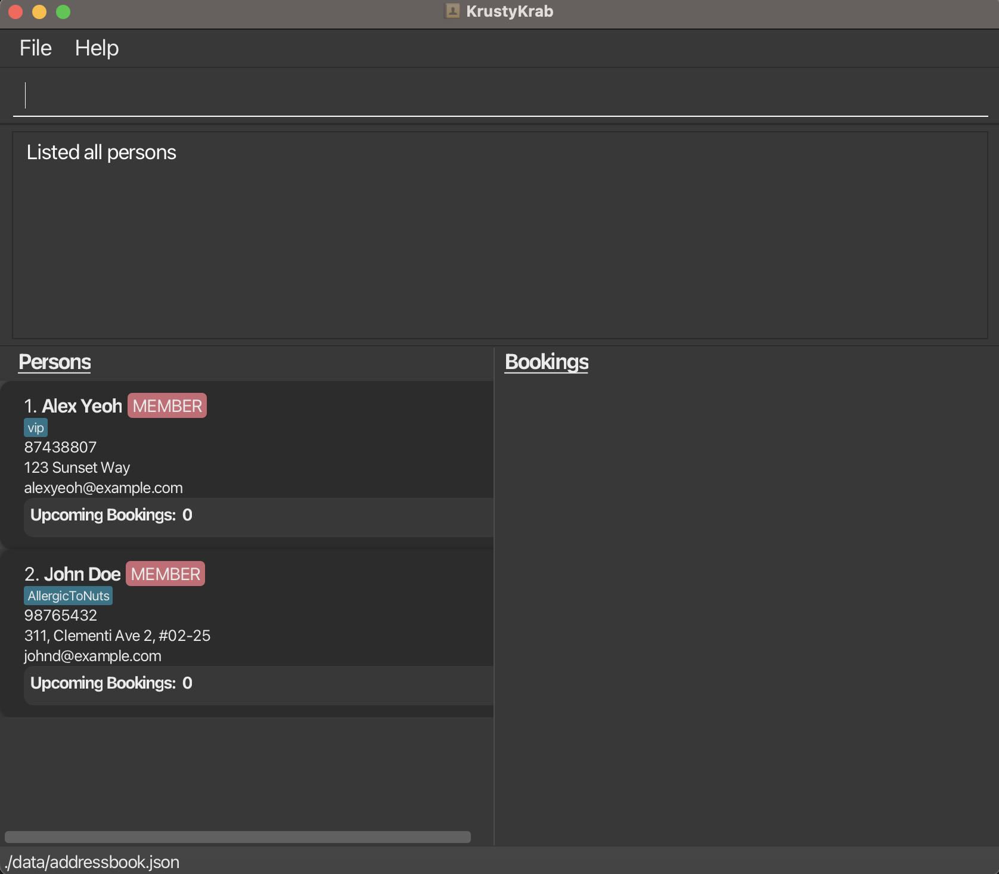


---
## 4. Booking Commands
A person can have **zero, one or more** bookings, but each booking must have **exactly one** associated person, 
which is referenced via their phone number.


<br>

### 4.1. Adding a booking: `badd`

Adds a booking to the bookings list.

Format: `badd d/DATE_TIME p/PHONE x/PAX [r/REMARK]`

<box type="tip" seamless>

**Tips:**
- The phone number must belong to an existing person.
- Date and time must be in the format: `yyyy-MM-dd h:mm a`  
  (e.g., `2025-04-03 2:30 PM`).
- `PAX` refers to your dining group size, with a maximum of 500.
- You can include an optional remark for the booking.

</box>

Examples:
* `badd d/2025-04-03 2:30 PM p/98765432 x/5 r/Birthday Celebration`
* `badd d/2025-06-10 7:00 PM p/91234567 x/2`

<br>

<box type="warning" seamless style="background-color: #FFF9E5; border-color: #FFC000;">

**Caution:** It is possible to create a booking with a date that has already passed, but a warning will be generated to notify the user.

</box>

`badd d/2021-10-31 3:00 PM p/87438807 x/5 r/Birthday Celebration`
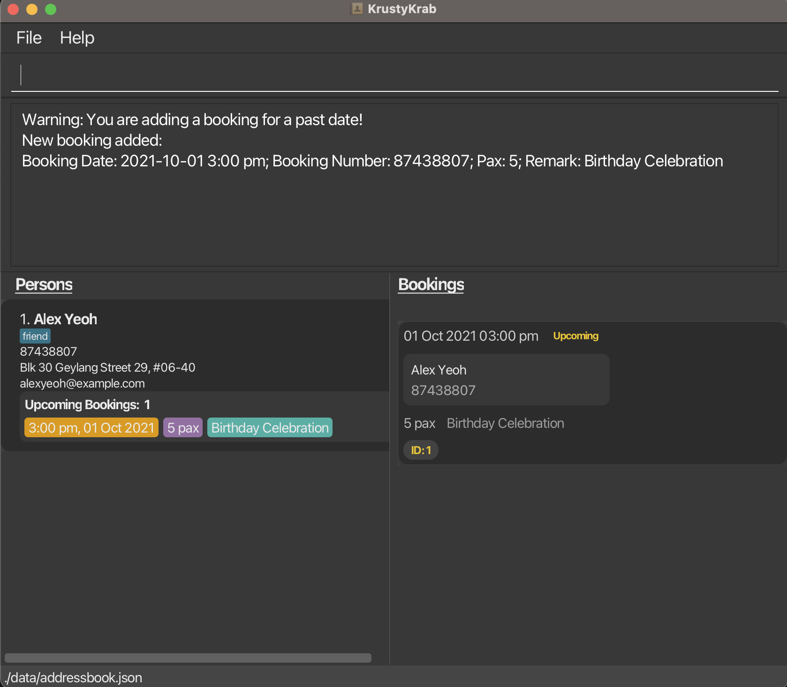

### 4.2. Editing a booking: `bedit`

Edits the details of the booking identified by the booking ID.  
Existing values will be overwritten by the input values.

Format:  
`bedit b/BOOKING_ID [d/DATETIME] [x/PAX] [r/REMARK]`

<box type="tip" seamless>

**Tips:**
- `BOOKING_ID` refers to the ID assigned to the booking (viewable using `blist`).
- Date and time must follow the format: `yyyy-MM-dd h:mm a`  
  (e.g., `2025-04-01 9:00 PM`).
- You must provide at least one field to edit.
- A warning will be shown if you edit the booking to a past date/time.

</box>

<box type="note" seamless>

**Note:** KrustyKrab allows you to edit existing bookings that are **not currently being displayed** in the bookings list.
For example, if your most recent command was `filter p/98765432`, you can still edit a booking with `BOOKING_ID` '_2_' that
belongs to a different phone number,
even though it is not currently displayed.

</box>

Examples:
* `bedit b/1 d/2025-04-01 9:00 PM x/4 r/Anniversary`
* `bedit b/3 r/Changed to private room`
* `bedit b/2 d/2025-05-12 12:00 PM`

`bedit b/5 x/7 r/Dinner`
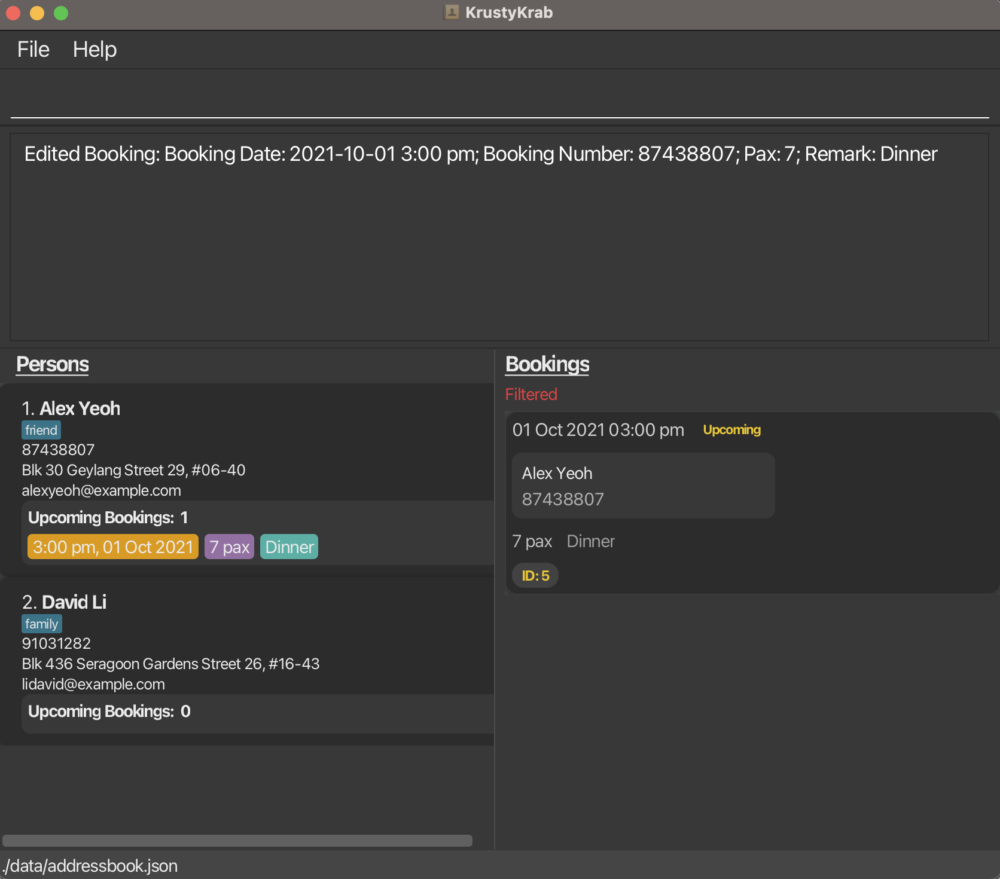

<br>

### 4.3. Deleting a booking : `bdelete`

Deletes the specified booking from the bookings list.

Format: `bdelete BOOKING_ID`

<box type="tip" seamless>

**Tips:**

- `BOOKING_ID` refers to the unique booking ID of the booking.
- `BOOKING_ID` **must be a positive integer** e.g. 1, 2, 3, …​

</box>

<box type="note" seamless>

**Note:** KrustyKrab allows you to delete bookings that are **not currently being displayed** in the bookings list.
For example, if my most recent command was `filter p/98765432`, I can still delete a booking with `BOOKING_ID` 2 that
belongs to a different phone number,
even though it is not currently displayed.

</box>


Examples:
* `bdelete 2` deletes the booking with ID 2.

`bdelete 1`
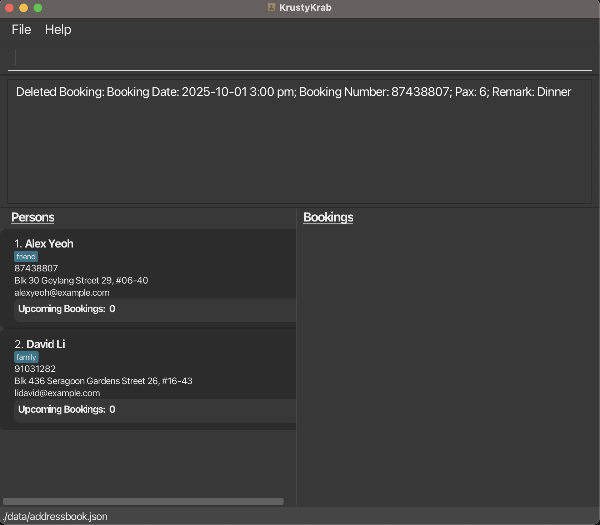

<br>

### 4.4. Marking a booking status: `mark`

Marks a booking with a new status (UPCOMING, COMPLETED, CANCELLED).

Format:  
`mark b/BOOKING_ID s/STATUS`

<box type="tip" seamless>

**Tips:**

- The `BOOKING_ID` is shown when you list bookings.
- Status must be exactly one of: `UPCOMING`, `COMPLETED`, `CANCELLED`.
- Status is case-insensitive (e.g., upcoming and Completed are valid).
- If a booking is marked to a status that is the same as its current status, nothing will change.
</box>

<box type="note" seamless>

**Note:** KrustyKrab allows you to mark the status of bookings that are **not currently being displayed** in the bookings list.
For example, if my most recent command was `filter p/98765432`, I can still mark the status of a booking with `BOOKING_ID` 2 that
belongs to a different phone number,
even though it is not currently displayed.

</box>

Example:
* `mark b/2 s/COMPLETED` marks the booking with ID 2 as completed.

`mark b/1 s/COMPLETED`
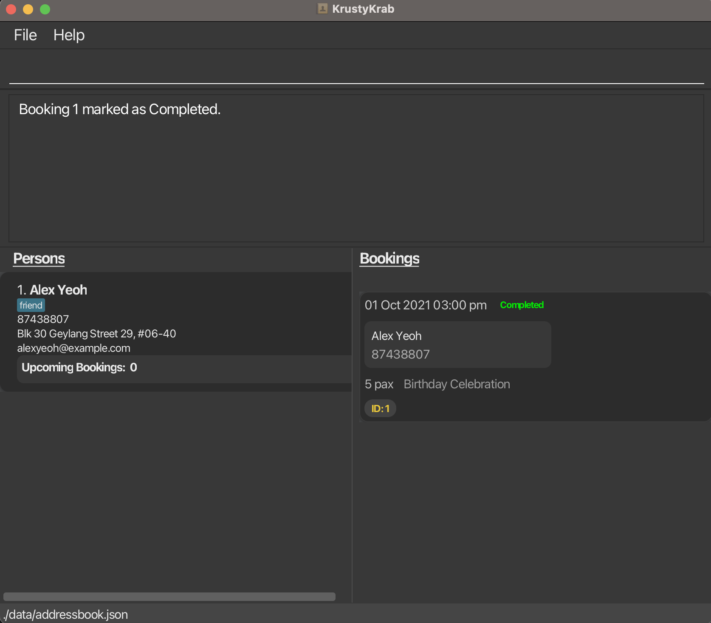

<br>

### 4.5. Filtering bookings: `filter`

Filters and displays bookings based on phone number, date, status, or any combination of those parameters.

Format:  
`filter [p/PHONE_NUMBER] [d/DATE] [s/STATUS]`

<box type="tip" seamless>

**Tips:**
- At least one parameter must be provided.
- Phone number must match an existing person.
- Date must be in the format: `yyyy-MM-dd` (e.g., `2023-12-25`).
- Status must be one of: `UPCOMING`, `COMPLETED`, or `CANCELLED`.
- You can combine different parameters to filter bookings more precisely.
- Only one of each parameter can be included in the command.

</box>

Examples:
* `filter p/98765432` - Shows all bookings made by the person with phone number 98765432
* `filter d/2023-12-25` - Shows all bookings on 25 December 2023
* `filter s/COMPLETED` - Shows all bookings marked as completed
* `filter p/98765432 d/2023-12-25` - Shows all bookings made by the person with phone 98765432 on 25 December 2023
* `filter p/98765432 s/UPCOMING` - Shows all upcoming bookings for the person with phone 98765432

`filter s/UPCOMING`
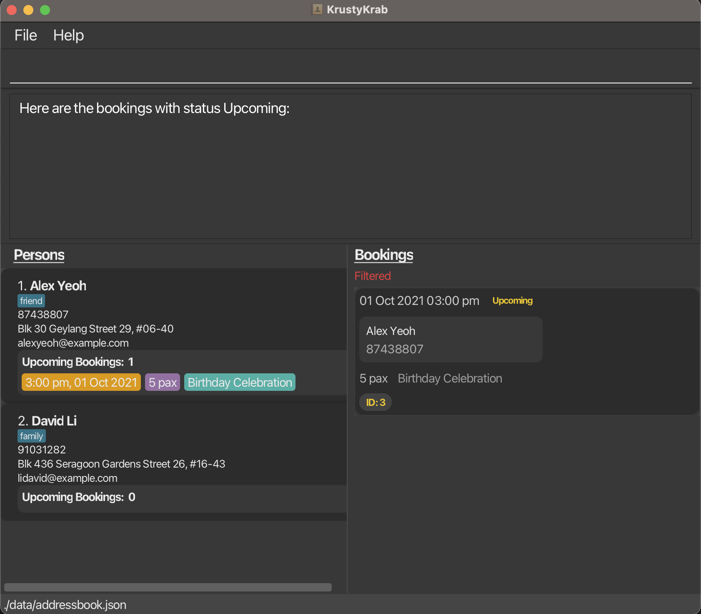

<br>

### 4.6. Listing bookings: `blist`

Shows all bookings in the bookings list.

Format:
* `blist` : Lists only upcoming bookings.
* `blist /all` : Lists **all** bookings (including bookings with status completed/cancelled).

`blist`
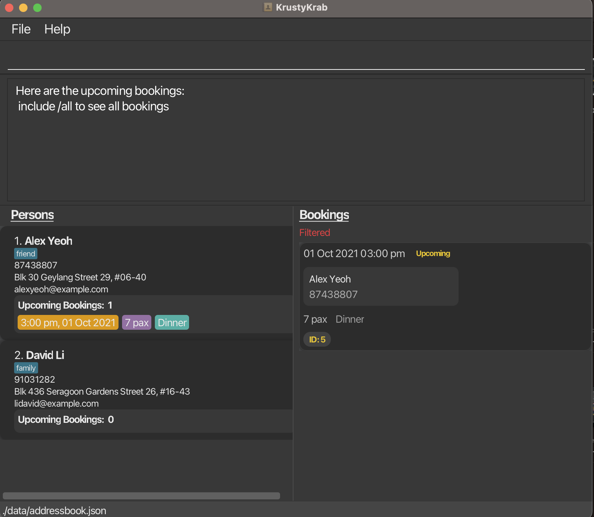

<br>

### 4.7. Summarising bookings of the day: `today`

Shows all bookings scheduled for today and the persons who made those bookings.

Format: `today`

* Displays all bookings for the current date.
* Also shows a summary count of upcoming, completed and cancelled bookings for today.
* Shows the list of persons who have bookings today.

Example:
* `today` → Lists all of today's bookings and persons who made those bookings.

`today`
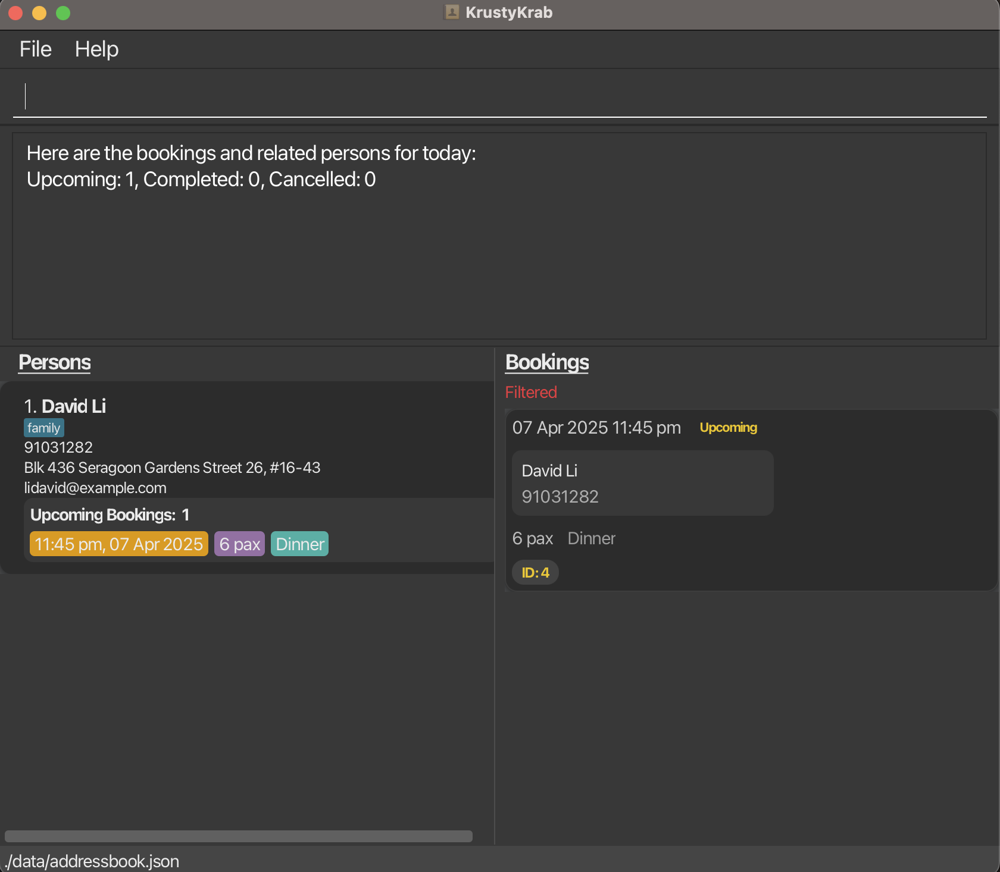

<br>

### 4.8. Clearing completed and cancelled bookings: `clearbookings`

Clears all bookings marked as **Completed** or **Cancelled**.

Format: `clearbookings`

<box type="warning" seamless style="background-color: #FFCCCC; border-color: #FF0000;">

**Warning:** All Completed or Cancelled bookings will be cleared. This action is irreversible! Ensure you want to delete these bookings before proceeding.

</box>

`clearbookings`
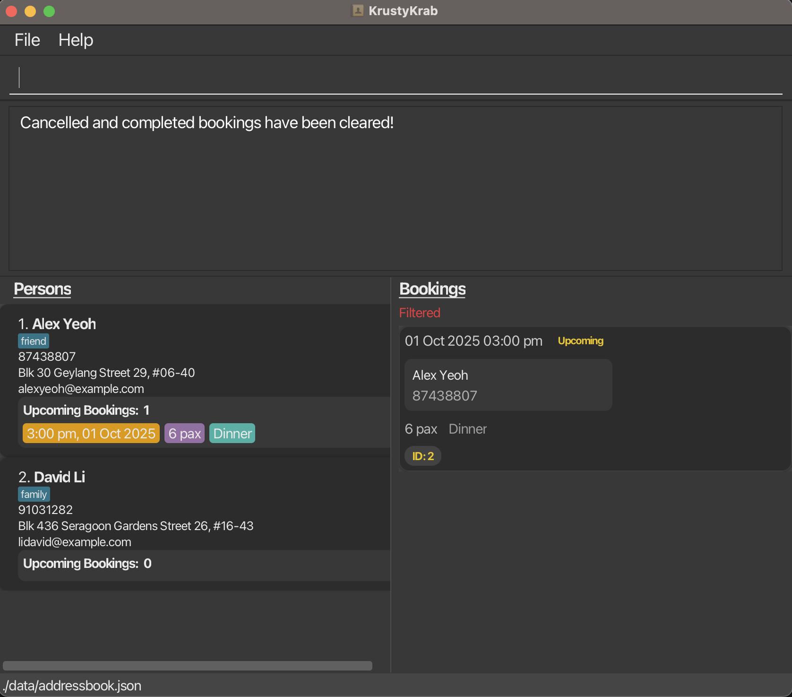

---
## 5. General Commands
Listed below are the currently supported general commands.

<br>

### 5.1. Clearing all entries : `clearall`

Clears all person entries and booking entries.

<box type="warning" seamless style="background-color: #FFCCCC; border-color: #FF0000;">

**Warning:** All persons and bookings will be cleared. This action is irreversible!

</box>

Format: `clearall`

`clearall`
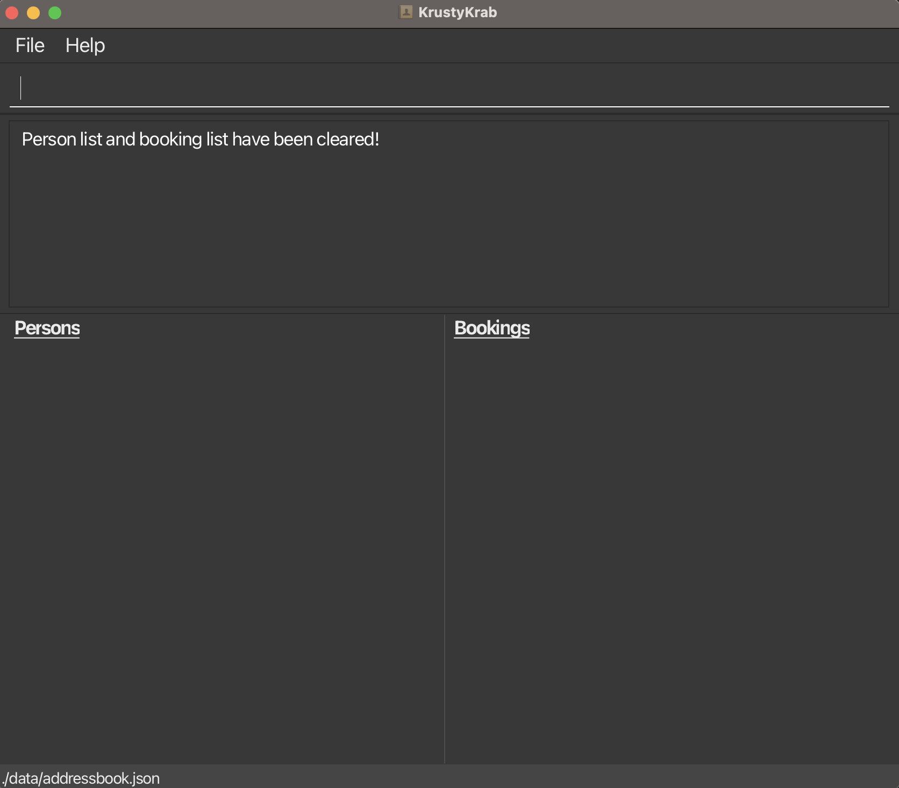

<br>

### 5.2. Viewing help : `help`

Shows a message explaining how to access the help page.

Format: `help`

`help`<br>


<br>

### 5.3. Exiting the program : `exit`

Exits the program.

Format: `exit`

<br>

--------------------------------------------------------------------------------------------------------------------
### Saving the data

KrustyKrab data are saved in the hard disk automatically after any command that changes the data. There is no need to save manually.

<br>

### Editing the data file

KrustyKrab data are saved automatically as a JSON file `[JAR file location]/data/addressbook.json`. Advanced users are welcome to update data directly by editing that data file.

<box type="warning" seamless style="background-color: #FFF9E5; border-color: #FFC000;">

**Caution:**
If your changes to the data file makes its format invalid, KrustyKrab will discard all data and start with an empty data file at the next run.  Hence, it is recommended to take a backup of the file before editing it.<br>
Furthermore, certain edits can cause the KrustyKrab to behave in unexpected ways (e.g., if a value entered is outside the acceptable range). Therefore, edit the data file only if you are confident that you can update it correctly.

</box>

<br>

### Archiving data files `[coming in v2.0]`

_Details coming soon ..._

--------------------------------------------------------------------------------------------------------------------

## 6. FAQ

**Q**: How do I transfer my data to another Computer?<br>
**A**: Install the app in the other computer and overwrite the empty data file it creates with the file that contains the data of your previous KrustyKrab home folder.

--------------------------------------------------------------------------------------------------------------------

## 7. Known issues

1. **When using multiple screens**, if you move the application to a secondary screen, and later switch to using only the primary screen, the GUI will open off-screen. The remedy is to delete the `preferences.json` file created by the application before running the application again.
2. **If you minimize the Help Window** and then run the `help` command (or use the `Help` menu, or the keyboard shortcut `F1`) again, the original Help Window will remain minimized, and no new Help Window will appear. The remedy is to manually restore the minimized Help Window.

--------------------------------------------------------------------------------------------------------------------
## 8. Command summary

Action                | Format, Examples
----------------------|----------------------------------------------------------------------------------------------------------------------------------------------------------------------
**Add Person**      | `padd n/NAME p/PHONE_NUMBER e/EMAIL a/ADDRESS [m/IS_MEMBER] [t/TAG]…​` <br> e.g., `padd n/James Ho p/22224444 e/jamesho@example.com a/123, Clementi Rd, 1234665 t/friend`
**Edit Person**     | `pedit INDEX [n/NAME] [e/EMAIL] [a/ADDRESS] [m/IS_MEMBER] [t/TAG]…​` <br> e.g.,`pedit 3 a/123 Sunset Way m/true t/friend t/vip`
**Delete Person**   | `pdelete INDEX` <br> e.g., `pdelete 3`
**Find Person**    | `find KEYWORD [MORE_KEYWORDS]` <br> e.g., `find James Jake`
**List Person**    | `plist`
**Add Booking**       | `badd d/DATE_TIME p/PHONE x/PAX [r/REMARK]` <br> e.g., `badd d/2025-04-03 2:30 PM p/98765432 x/5 r/Birthday Celebration`
**Edit Booking**      | `bedit b/BOOKING_ID [d/DATETIME] [x/PAX] [r/REMARK]` <br> e.g., `bedit b/1 d/2025-04-01 9:00 PM x/4 r/Anniversary`
**Delete Booking**    | `bdelete INDEX` <br> e.g., `bdelete 2`
**Mark Booking**      | `mark b/BOOKING_ID s/STATUS` <br> e.g., `mark b/2 s/COMPLETED`
**Filter Bookings**   | `filter [p/PHONE_NUMBER] [d/DATE] [s/STATUS]` <br> e.g., `filter p/98765432`, `filter d/2023-12-25`, `filter s/COMPLETED`
**List Bookings**     | `blist`<br> `blist /all`
**Today's Bookings**  | `today`
**Clear Bookings**    | `clearbookings`
**Clear All**         | `clearall`
**Help**              | `help`
**Exit**              | `exit`

--------------------------------------------------------------------------------------------------------------------
### 9. Glossary

* **Java**: A popular programming language used to build platform-independent applications. KrustyKrab requires Java 17 or above to run.
* **Command Terminal**: A text-based interface where users can type and execute commands directly on their operating system (e.g., Command Prompt on Windows, Terminal on macOS/Linux).
* **Oracle**: A software company that maintains the official Java Development Kit (JDK) and provides downloadable versions of Java for developers.
* **JDK (Java Development Kit)**: A software development environment that provides tools necessary to write, compile, and run Java applications. It includes the Java Runtime Environment (JRE), compiler, and other development tools.
* **cd**: Stands for "change directory". A command used in the terminal to navigate to a specific folder on your computer. e.g. `cd C:\Users\MyFolder`.
* **Command**: An instruction typed into the terminal or KrustyKrab’s command box to perform a specific action. For example, `padd` adds a new person.
* **Parameter**: A specific part of a command that provides input values. For instance, in `padd n/John Doe`, `n/John Doe` is a parameter that specifies the name.
* **JSON (JavaScript Object Notation)**: A lightweight data format used to store KrustyKrab’s data (e.g., persons and bookings). It is saved automatically in a `.json` file and can be edited manually if needed.
